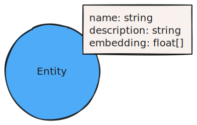

## Context

The biggest problem with the vector search approach as in the e.g. [Basic Retrievers](/reference/graphrag/basic-retriever) or [Parent-Child Retrievers](/reference/graphrag/parent-child-retriever) is finding all relevant context that is necessary to answer a question. The context can be spread across many chunks not being found by the search. Relating the real-world entities from the chunks to each other and retrieving these relationships together with a vector search provides additional context about these entities that the chunks deal with.

## Graph Pattern

## Elements

### Nodes

Document nodes contain the document name and its source. They may contain additional metadata.

Chunk nodes contain the human readable text of a chunk and its vector embedding. They may contain additional metadata.

Entity nodes contain the name of the entity. Additionally they might contain a description of the entity and a vector embedding (of name and description). They may contain additional metadata. Entity nodes can have additional labels based on the extraction prompt.

### Relationships

The PART_OF relationships do not require additional properties. However, they may contain additional metadata.

The HAS_ENTITY relationships do not require additional properties. However, they may contain additional metadata.

The RELATES_TO relationships are examplary here. They can have any type based on the extraction prompt. They may also have a description. They may contain additional metadata.

## Description

Use an LLM to execute entity and relationship extraction on the chunks. Import the retrieved triples into the Graph.

## GraphRAG Pattern

A Lexical Graph with Extracted Entities is used in [Augmented Vector Search](/reference/graphrag/augmented-vector-search).
